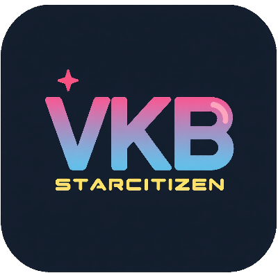
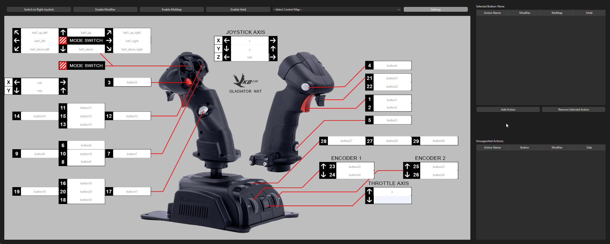

# StarCitizen Bind VKB

## Work in Progress

This project is currently a work in progress and is not yet useful. The goal of this project is to provide a tool for users with VKB joysticks to quickly view, save, edit, and reapply their various control mappings exported from Star Citizen without needing to enter the game.

### Demo

### Features

- **View Control Mappings**: Easily view your joystick control mappings exported from Star Citizen.
- **Save Configurations**: Save your current joystick configurations to a file.
- **Edit Configurations**: Edit your joystick configurations outside of the game.
- **Reapply Configurations**: Reapply your edited configurations back into the game.
- **Joystick Identification**: Solve issues where Star Citizen loses track of which joystick is joystick 1, 2, 3, etc., whenever another device is plugged in and the game is launched,  forcing you to resort devices, and losing track of axis settings.

### Future Plans

- Improve the user interface for better usability.
- Add more robust error handling and validation.
- Enhance the configuration editing capabilities.

Stay tuned for updates as we continue to develop and improve this tool!
